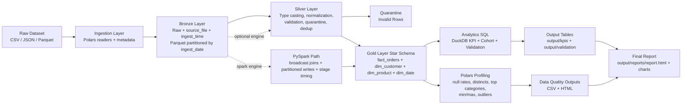

# Lakehouse_Analytics_Pipeline

Batch lakehouse prototype with Bronze/Silver/Gold layers, SQL KPIs, Polars profiling, and CI.

## Quick Start

```bash
python -m venv .venv
source .venv/bin/activate
pip install -e .[dev]
make smoke
```

Install Spark support when needed:

```bash
sudo apt-get install openjdk-17-jdk
pip install -e .[dev,spark]
```

Install dashboard support when needed:

```bash
pip install -e .[dashboard]
```

Verify Java:

```bash
java -version
```

## Commands

```bash
lakehouse run --input data/sample/orders.csv --output output
lakehouse run --input data/raw/yellow_tripdata_2024-01.parquet --output output
lakehouse run --input data/sample/orders.csv --output output --engine spark
lakehouse run --input data/raw/yellow_tripdata_2024-01.parquet --output output --engine spark
lakehouse run --input data/raw/yellow_tripdata_2024-01.parquet --output output --engine spark --incremental
lakehouse run --input data/raw/yellow_tripdata_2024-01.parquet --output output --engine spark --incremental --full-refresh
streamlit run streamlit_app.py
make lint
make test
```

## Streamlit KPI Browser

The Streamlit app lets you browse:

- KPI outputs from `output/kpis/*.csv`
- Validation outputs from `output/validation/*.csv`
- Report charts and HTML report paths from `output/reports/`

Run:

```bash
python -m lakehouse_pipeline.cli run --input data/sample/orders.csv --output output --engine spark
streamlit run streamlit_app.py
```

### Streamlit Cloud (Yellow Taxi Results)

For stable cloud deployment, compute heavy outputs locally and publish curated artifacts:

```bash
python -m lakehouse_pipeline.cli run --input data/raw/yellow_tripdata_2024-01.parquet --output output_big --engine spark --full-refresh
./scripts/prepare_web_outputs.sh output_big output_web
```

Then commit `output_web/` and deploy Streamlit.  
The app defaults to `output_web` when available.

## Outputs

- `output/bronze/`: raw + ingest metadata
- `output/silver/`: standardized and deduplicated records
- `output/quarantine/`: invalid rows
- `output/gold/`: `fact_orders`, `dim_customer`, `dim_product`, `dim_date`
- enriched dimensions also include `dim_vendor` and `dim_category`
- `output/kpis/`: KPI query results and retention matrix CSV
- `output/validation/`: duplicate, null-rate, and referential-integrity SQL checks
- `output/reports/`: data quality summary (CSV/HTML), profile table, 4 charts, final `report.html`

## Supported Input Schemas

- Canonical order schema:
  - `order_id`, `customer_id`, `product_id`, `order_ts`, `updated_at`, `category`, `amount`, `quantity`
- NYC TLC yellow taxi schema (auto-mapped internally to canonical):
  - `VendorID`, `tpep_pickup_datetime`, `tpep_dropoff_datetime`, `PULocationID`, `DOLocationID`, `total_amount`, `fare_amount`, `passenger_count`

## Data Source

- Official NYC TLC trip record data page:
  - https://www.nyc.gov/site/tlc/about/tlc-trip-record-data.page
- Direct file used in this project:
  - https://d37ci6vzurychx.cloudfront.net/trip-data/yellow_tripdata_2024-01.parquet

Download data locally:

```bash
./scripts/download_data.sh
```

Or download only the main file:

```bash
mkdir -p data/raw
curl -L --fail https://d37ci6vzurychx.cloudfront.net/trip-data/yellow_tripdata_2024-01.parquet -o data/raw/yellow_tripdata_2024-01.parquet
```

## Incremental Loads

- Enable watermark-based incremental loads with `--incremental`.
- Watermark source: max `updated_at` in existing Silver output.
- New records are merged with existing Silver and deduplicated deterministically by latest `updated_at` per `order_id`.
- Use `--full-refresh` to force complete recomputation even when `--incremental` is enabled.

## Architecture



### Layer Responsibilities

- Ingestion: reads raw files and appends ingest metadata.
- Bronze: immutable raw records with ingestion context.
- Silver: standardized schema, validation checks, deterministic latest-row dedup, invalid-row quarantine.
- Gold: analytics-ready star schema for KPI computation.
- Analytics: DuckDB executes KPI, cohort retention, and validation SQL deliverables.
- Profiling and reporting: Polars profiling plus a reproducible HTML report with charts.

## Verification Run

Run the full pipeline (big dataset + Spark):

```bash
python -m lakehouse_pipeline.cli run --input data/raw/yellow_tripdata_2024-01.parquet --output output_big --engine spark
```

## Generated Artifacts

1. Pipeline logs showing Bronze, Silver dedup stats, Gold table creation, KPI execution, validation execution, and cache stats.
2. `output_big/bronze/` parquet output.
3. `output_big/silver/` and `output_big/quarantine/` outputs.
4. `output_big/gold/` star schema outputs (`fact_orders`, `dim_customer`, `dim_product`, `dim_date`).
5. `output_big/kpis/` KPI CSVs and `cohort_retention.csv`.
6. `output_big/validation/` validation SQL outputs.
7. `output_big/reports/` outputs:
`data_profile.csv`, `data_quality_summary.csv`, `data_quality_summary.html`, chart PNGs, and `report.html`.
8. CI status from `.github/workflows/ci.yml` with passing lint + tests + smoke.
