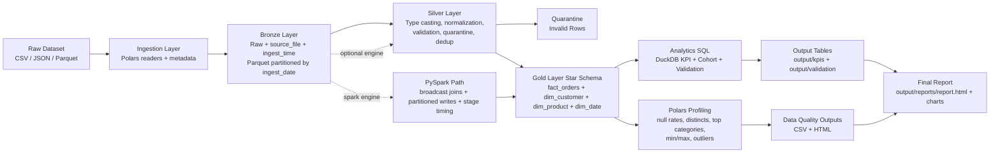

# Architecture

## Layer Responsibilities

- Ingestion: reads raw files and appends ingest metadata.
- Bronze: immutable raw records with ingestion context.
- Silver: standardized schema, validation checks, deterministic latest-row dedup, invalid-row quarantine.
- Gold: analytics-ready star schema for KPI computation.
- Analytics: DuckDB executes KPI, cohort retention, and validation SQL deliverables.
- Profiling and reporting: Polars profiling plus a reproducible HTML report with charts.
